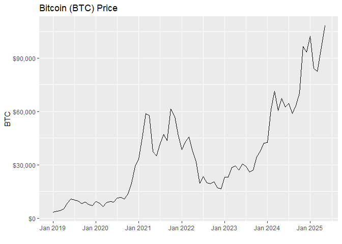
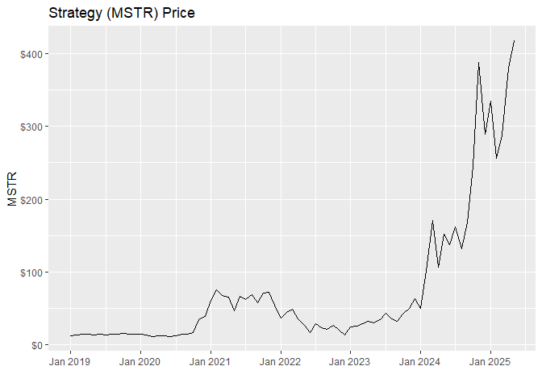
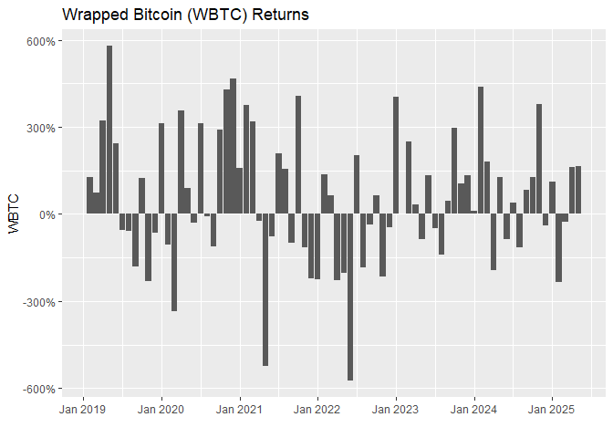
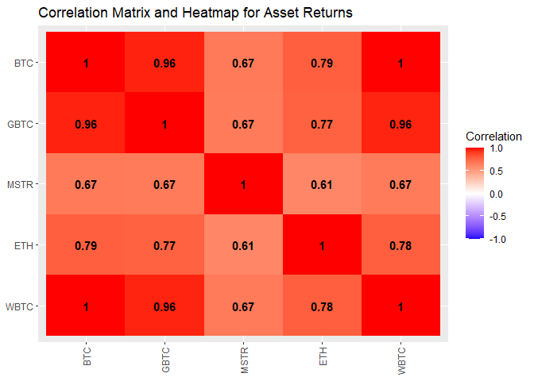
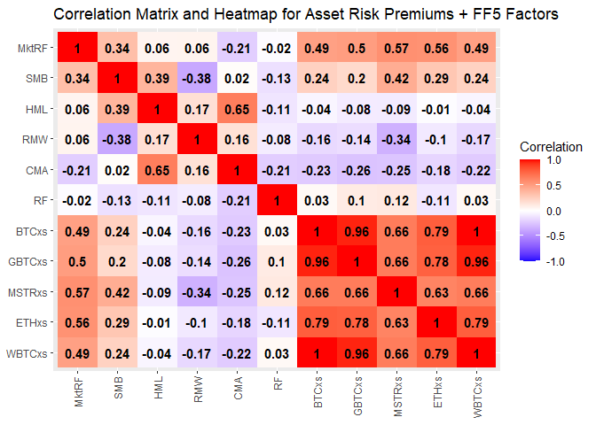

Bitcoin Factor Analysis
================
Last updated: 2025-05-21

## Preliminary Work: Install/Load Packages

To try and ensure that this R Notebook will run successfully, we’ll use
the [renv
package](https://cran.r-project.org/web/packages/renv/index.html) to
create a project-specific library of packages. This will allow us to
install the packages that we need for this project without affecting any
other projects that we may be working on. Additionally, the project
library will track the specific versions of the dependency packages so
that any updates to those packages will not break this project.

The code chunk below will first install the renv package if it is not
already installed. Then we will load the package. Next, we’ll use the
`restore()` function to install any packages listed in the renv.lock
file. Once these packages are installed, we can load them into the R
session using the `library()` commands. Below the code chunk, we’ll list
out the packages that will be used in the project demo. And if you run
into any trouble using renv, then you can use the second code chunk
below and that should be an even more reliable approach to install the
required packages.

``` r
# Install renv package if not already installed
if(!"renv" %in% installed.packages()[,"Package"]) install.packages("renv")
# Load renv package
library(renv)
# Use restore() to install any packages listed in the renv.lock file
renv::restore(clean=TRUE, lockfile="../renv.lock")
# Load in the packages
library(quantmod)
library(tidyverse)
library(scales)
library(reshape2)
library(corrplot)
library(jsonlite)
library(tseries)
library(rmarkdown)
```

- The [quantmod package](https://cran.r-project.org/package=quantmod)
  contains tools for importing and analyzing financial data.
- The [tidyverse package](https://www.tidyverse.org/) contains a suite
  of packages for data manipulation and visualization.
- The [scales package](https://cran.r-project.org/package=scales) lets
  us format numbers and dates in plots.
- The [reshape2 package](https://cran.r-project.org/package=reshape2)
  contains the `melt` function that will be used.
- The [corrplot package](https://cran.r-project.org/package=corrplot)
  lets us create correlation plots.
- The [jsonlite package](https://cran.r-project.org/package=jsonlite)
  lets us more easily import JSON data.
- The [tseries package](https://cran.r-project.org/package=tseries)
  contains additional time series analysis functions that we will
  explore.
- The [rmarkdown package](https://cran.r-project.org/package=rmarkdown)
  is used to generate this R Notebook.

Since the rmarkdown functionality is built into RStudio, this last one
is automatically loaded when you open RStudio. So no need to use the
`library()` function for it. Another observation to make about the code
chunk above is that it is labeled as `setup`, which is a special name,
which the R Notebook will recognize and automatically run prior to
running any other code chunk. This is useful for loading in packages and
setting up other global options that will be used throughout the
notebook.

Then if you wish to try and update the versions of the various R
packages in the lock file, you can use the `renv::update()` function to
update the packages in the project library. However, it is possible that
these updates could break the code in this notebook. If so, you may need
to adapt the code to work with the updated packages.

My recommendation is to first run through the code using the versions of
the packages in the lock file. Then if you want to try and update the
packages, you can do so and then run through the code again to see if it
still works. If not, you can always revert back to the lock file
versions using the `renv::restore()` function.

If you update the packages and get everything working successfully, then
you can update the lock file using the `renv::snapshot()` function. This
will update the lock file with the versions of the packages that are
currently installed in the project library. Then you can commit the
updated lock file to the repository so that others can use the updated
versions of the packages.

### Alternative Package Installation Code

If you run into any trouble using renv in the code chunk above, then you
can use the code chunk below to install the required packages for this
analysis. This method will first check if you have already installed the
packages. If any are missing, it will then install them. Then it will
load the packages into the R session. A potential flaw in this approach
compared to using renv is that it will simply install the latest
versions of the packages, which could potentially break some of the code
in this notebook if any of the updates aren’t backwards compatible.

As long as you have downloaded the entire project repository, the renv
chunk above will likely be managing the packages. Thus, the `eval=FALSE`
option is used to prevent this chunk from running unless manually
executed. So if you only downloaded this one Rmd file, this code chunk
should take care of installing the packages for you.

``` r
# Create list of packages needed for this exercise, omit geckor since its not on CRAN
list.of.packages = c("quantmod","tidyverse","scales","corrplot","jsonlite","tseries","rmarkdown")
# Check if any have not yet been installed
new.packages = list.of.packages[!(list.of.packages %in% installed.packages()[,"Package"])]
# If any need to be installed, install them
if(length(new.packages)) install.packages(new.packages)
# Load in the packages
library(quantmod)
library(tidyverse)
library(scales)
library(corrplot)
library(jsonlite)
library(tseries)
```

## Data Imports

This section will build out a cleaned dataset for use in the subsequent
analysis. To start, we’ll import the bitcoin price data from Yahoo
Finance using the quantmod package. Additionally, we’ll collect data for
a few other similar assets to compare with BTC. Then we’ll import the
factor data from Kenneth French’s website to see if known equity factors
explain bitcoin returns. Lastly, we’ll import some more bitcoin-specific
data to make a more tailored asset pricing model.

### Asset Data Import and Cleaning

The `getSymbols()` function from the quantmod package let’s use import
the daily price data for the various assets. The `src="yahoo"` argument
specifies that we want to pull the data from Yahoo Finance. The `from`
and `to` arguments specify the date range for the data. Rather than
assigning a variable name to the output of `getSymbols()`, the function
creates a new variable for each ticker in the list, named after the
ticker. The last few lines of the code chunk below show how to rename
the variable to something more manageable.

Currently, the additional assets beyond bitcoin (BTC) include:

- Grayscale Bitcoin Trust/ETF (GBTC)
- Microstrategy stock (MSTR)
- Ethereum (ETH)
- Wrapped Bitcoin (WBTC)

To simplify the analysis and make the asset data more comparable, we’ll
start the data on January 30, 2019, which is when WBTC (the most recent
asset currently) has its earliest observation.

``` r
startdate = "2019-01-30"
tickers = c("BTC-USD","GBTC","MSTR","ETH-USD","WBTC-USD")
getSymbols(tickers,
           src="yahoo",
           from=startdate,
           to=Sys.Date())
BTC = `BTC-USD`
ETH = `ETH-USD`
WBTC = `WBTC-USD`
```

Now that we have the daily price series, let’s extract the close prices
into a univariate xts object. Then we can rename the column to `"Close"`
to keep variable names simple. After that, let’s aggregate the daily
prices to a monthly series. The xts package (which is a dependency of
quantmod) allows us to easily convert the daily price data into a
monthly OHLC series using `to.monthly()`. The `name=NULL` option in
those functions prevents the variable names from including the name of
the original object.

``` r
# Create daily series and rename column
BTCdaily = BTC$`BTC-USD.Close` 
names(BTCdaily) = "Close"
# Convert to monthly series
BTCmonthOHLC = to.monthly(BTCdaily$Close, name=NULL)
BTCmonth = BTCmonthOHLC$Close
# Same for GBTC
GBTCdaily = GBTC$GBTC.Close
names(GBTCdaily) = "Close"
GBTCmonthOHLC = to.monthly(GBTCdaily$Close, name=NULL)
GBTCmonth = GBTCmonthOHLC$Close
# Same for MSTR
MSTRdaily = MSTR$MSTR.Close
names(MSTRdaily) = "Close"
MSTRmonthOHLC = to.monthly(MSTRdaily$Close, name=NULL)
MSTRmonth = MSTRmonthOHLC$Close
# Same for ETH
ETHdaily = ETH$`ETH-USD.Close` 
names(ETHdaily) = "Close"
ETHmonthOHLC = to.monthly(ETHdaily$Close, name=NULL)
ETHmonth = ETHmonthOHLC$Close
# Same for WBTC
WBTCdaily = WBTC$`WBTC-USD.Close` 
names(WBTCdaily) = "Close"
WBTCmonthOHLC = to.monthly(WBTCdaily$Close, name=NULL)
WBTCmonth = WBTCmonthOHLC$Close
```

Lastly, we’ll convert the monthly price series into annualized return
series. This can be done directly by composing the `diff()` and `log()`
functions. The `log()` function will take the natural logarithm of the
prices, and then the `diff()` function will subtract the previous
period’s value from the current period’s value. Then to make the series
more comparable, we’ll annualize the returns by multiplying by 12.
Lastly, we’ll adjust the units to percentages.

``` r
# Calculate annualized returns
BTCmonth$AnnRet = diff(log(BTCmonth$Close))*12*100
GBTCmonth$AnnRet = diff(log(GBTCmonth$Close))*12*100
MSTRmonth$AnnRet = diff(log(MSTRmonth$Close))*12*100
ETHmonth$AnnRet = diff(log(ETHmonth$Close))*12*100
WBTCmonth$AnnRet = diff(log(WBTCmonth$Close))*12*100
```

### Fama/French Factors

To model the asset returns, we’ll import the Fama/French Factors. The
earlier [Fama and French
(1993)](https://doi.org/10.1016/0304-405X(93)90023-5) paper introduced a
three-factor model that includes SMB (Small Minus Big) as a ‘size’
factor and HML (High Minus Low) as a ‘value’/‘growth’ factor. See [the
3-Factors
webpage](https://mba.tuck.dartmouth.edu/pages/faculty/ken.french/Data_Library/f-f_factors.html)
for more detail. The data is also available there at the url in the data
chunk below. Since these are available as compressed folders, we must
first download the file (we’ll put it in a sub-folder, Factor Data) and
then decompress (unzip) the file before reading in the data. *Note the
extra entry in the .gitignore file for the repository. This prevents git
from syncing the datasets to the repo.*

``` r
ff3url = "https://mba.tuck.dartmouth.edu/pages/faculty/ken.french/ftp/F-F_Research_Data_Factors_CSV.zip"
# Create subdirectory for file downloads
subdirectory = "Factor Data"
dir.create(subdirectory, showWarnings=FALSE)
# Define the file paths
zip_filepath = file.path(subdirectory, "FF3-factors.zip")
csv_filepath = file.path(subdirectory, "FF3-factors.csv")
# Download the zip file
download.file(ff3url, destfile=zip_filepath)
# Extract the CSV file from the zip file
unzip(zip_filepath, exdir=subdirectory)
# The file name in the line below comes from the name of the file within the zipped file
file.rename("Factor Data/F-F_Research_Data_Factors.CSV", csv_filepath)
```

    ## [1] TRUE

``` r
FF3 = read_csv(csv_filepath,
               col_types = cols(...1 = col_date(format = "%Y%m")), 
               skip = 2)
```

    ## New names:
    ## • `` -> `...1`

    ## Warning: One or more parsing issues, call `problems()` on your data frame for details,
    ## e.g.:
    ##   dat <- vroom(...)
    ##   problems(dat)

The code chunk above reports a warning about some parsing errors. So
let’s investigate with `problems()`.

``` r
problems(FF3)
```

    ## # A tibble: 106 × 5
    ##      row   col expected       actual                           file             
    ##    <int> <int> <chr>          <chr>                            <chr>            
    ##  1  1184     1 5 columns      1 columns                        C:/Users/timma/P…
    ##  2  1184     1 date like %Y%m Annual Factors: January-December C:/Users/timma/P…
    ##  3  1185     2 a double       Mkt-RF                           C:/Users/timma/P…
    ##  4  1185     3 a double       SMB                              C:/Users/timma/P…
    ##  5  1185     4 a double       HML                              C:/Users/timma/P…
    ##  6  1185     5 a double       RF                               C:/Users/timma/P…
    ##  7  1186     1 date like %Y%m 1927                             C:/Users/timma/P…
    ##  8  1187     1 date like %Y%m 1928                             C:/Users/timma/P…
    ##  9  1188     1 date like %Y%m 1929                             C:/Users/timma/P…
    ## 10  1189     1 date like %Y%m 1930                             C:/Users/timma/P…
    ## # ℹ 96 more rows

Note how it refers us to the bottom of the data frame. These are the
annual observations that are included below the monthly data. Since
those annual dates do not import and are missing, we can use
`complete.cases()` to easily identify the appropriate columns to retain.
Then the date variable imports with an unusual name of `...1`, so we’ll
fix that, and then reformat to an xts object. Lastly, we use the
`paste()` function to generate a string of `"2019-01-30/"`. This type of
indexing is part of the xts package, and the `/` separates a start date
from an end date.

``` r
# Trim annual observations from bottom of date frame (dates import as missing)
FF3 = FF3[complete.cases(FF3),]
# Fix date variable name
FF3 = FF3 |> rename(Date=...1)
FF3 = FF3 |> rename(MktRF=`Mkt-RF`)
# Reformat to xts object
FF3xts = xts(FF3[,-1], order.by=FF3$Date)
# Remove data prior to first BTC observation
FF3xts = FF3xts[paste(startdate,"/",sep="")]
# Annualize factor data to match annualized return scaling (use RF as reference point)
FF3xts = FF3xts*12
```

More recently, [Fama and French
(2015)](https://doi.org/10.1016/j.jfineco.2014.10.010) includes two
additional factors: RMW (Robust Minus Weak) as a ‘profitability’ factor
and CMA (Conservative Minus Aggressive) factor. The [5-Factors
webpage](https://mba.tuck.dartmouth.edu/pages/faculty/ken.french/Data_Library/f-f_5_factors_2x3.html)
has more detail.

``` r
ff5url = "https://mba.tuck.dartmouth.edu/pages/faculty/ken.french/ftp/F-F_Research_Data_5_Factors_2x3_CSV.zip"
# Define the file paths
zip_filepath = file.path(subdirectory, "FF5-factors.zip")
csv_filepath = file.path(subdirectory, "FF5-factors.csv")
# Download the zip file
download.file(ff5url, destfile=zip_filepath)
# Extract the CSV file from the zip file
unzip(zip_filepath, exdir=subdirectory)
file.rename("Factor Data/F-F_Research_Data_5_Factors_2x3.CSV", csv_filepath)
```

    ## [1] TRUE

``` r
FF5 = read_csv(csv_filepath,
               col_types = cols(...1 = col_date(format = "%Y%m")), 
               skip = 2)
```

    ## New names:
    ## • `` -> `...1`

    ## Warning: One or more parsing issues, call `problems()` on your data frame for details,
    ## e.g.:
    ##   dat <- vroom(...)
    ##   problems(dat)

``` r
# Trim annual observations from bottom of date frame (dates import as missing)
FF5 = FF5[complete.cases(FF5),]
# Fix date variable name
FF5 = FF5 |> rename(Date=...1)
FF5 = FF5 |> rename(MktRF=`Mkt-RF`)
# Reformat numbers to numeric type and annualize
FF5$MktRF = as.numeric(FF5$MktRF)*12
FF5$SMB = as.numeric(FF5$SMB)*12
FF5$HML = as.numeric(FF5$HML)*12
FF5$RMW = as.numeric(FF5$RMW)*12
FF5$CMA = as.numeric(FF5$CMA)*12
FF5$RF = as.numeric(FF5$RF)*12
# Reformat to xts object
FF5xts = xts(FF5[,-1], order.by=FF5$Date)
# Remove data prior to first BTC observation
FF5xts = FF5xts[paste(startdate,"/",sep="")]
```

## Summary Statistics

Before running the factor model regressions, let’s first calculate some
summary statistics and generate some basic plots for the assets. We’ll
start by consolidating the asset prices into a single xts object and the
returns into another.

``` r
assetprices = merge(BTCmonth$Close,
                    GBTCmonth$Close,
                    MSTRmonth$Close,
                    ETHmonth$Close,
                    WBTCmonth$Close)
colnames(assetprices) = c("BTC","GBTC","MSTR","ETH","WBTC")
assetreturns = merge(BTCmonth$AnnRet,
                     GBTCmonth$AnnRet,
                     MSTRmonth$AnnRet,
                     ETHmonth$AnnRet,
                     WBTCmonth$AnnRet)
colnames(assetreturns) = c("BTC","GBTC","MSTR","ETH","WBTC")
# Drop first row from returns table (since it's NA)
assetreturns = assetreturns[-1,]
```

### Univariate Plots

First, lets visualize each of the price and return series. For prices,
we’ll use line plots. For returns, we’ll use bar plots.

``` r
# Plot the asset prices
ggplot(data=assetprices, aes(x=index(assetprices), y=BTC)) + geom_line() + xlab("") + 
  scale_y_continuous(labels = dollar_format()) + ggtitle("Bitcoin (BTC) Price")
```

<!-- -->

``` r
ggplot(data=assetprices, aes(x=index(assetprices), y=GBTC)) + geom_line() + xlab("") + 
  scale_y_continuous(labels = dollar_format()) + ggtitle("Grayscale Bitcoin Fund/ETF (GBTC) Price")
```

<!-- -->

``` r
ggplot(data=assetprices, aes(x=index(assetprices), y=MSTR)) + geom_line() + xlab("") + 
  scale_y_continuous(labels = dollar_format()) + ggtitle("Strategy (MSTR) Price")
```

<!-- -->

``` r
ggplot(data=assetprices, aes(x=index(assetprices), y=ETH)) + geom_line() + xlab("") + 
  scale_y_continuous(labels = dollar_format()) + ggtitle("Ethereum (ETH) Price")
```

<!-- -->

``` r
ggplot(data=assetprices, aes(x=index(assetprices), y=WBTC)) + geom_line() + xlab("") + 
  scale_y_continuous(labels = dollar_format()) + ggtitle("Wrapped Bitcoin (WBTC) Price")
```

<!-- -->

``` r
# Plot the asset returns
ggplot(data=assetreturns, aes(x=index(assetreturns), y=BTC)) + geom_col() + xlab("") + 
  scale_y_continuous(labels = percent_format(scale=1)) + ggtitle("Bitcoin (BTC) Returns")
```

<!-- -->

``` r
ggplot(data=assetreturns, aes(x=index(assetreturns), y=GBTC)) + geom_col() + xlab("") + 
  scale_y_continuous(labels = percent_format(scale=1)) + ggtitle("Grayscale Bitcoin Fund/ETF (GBTC) Returns")
```

<!-- -->

``` r
ggplot(data=assetreturns, aes(x=index(assetreturns), y=MSTR)) + geom_col() + xlab("") + 
  scale_y_continuous(labels = percent_format(scale=1)) + ggtitle("Strategy (MSTR) Returns")
```

<!-- -->

``` r
ggplot(data=assetreturns, aes(x=index(assetreturns), y=ETH)) + geom_col() + xlab("") + 
  scale_y_continuous(labels = percent_format(scale=1)) + ggtitle("Ethereum (ETH) Returns")
```

<!-- -->

``` r
ggplot(data=assetreturns, aes(x=index(assetreturns), y=WBTC)) + geom_col() + xlab("") + 
  scale_y_continuous(labels = percent_format(scale=1)) + ggtitle("Wrapped Bitcoin (WBTC) Returns")
```

<!-- -->

Another way to visualize the returns of each series is to use a density
plot. This will allow us to compare the distribution of returns for the
assets. The `facet_wrap()` function will allow us to compare the assets
side-by-side. *This component of the analysis was recommended by GitHub
Copilot.*

``` r
# Combine returns into a single data frame
assetreturnsdf = data.frame(index(assetreturns), assetreturns)
colnames(assetreturnsdf) = c("Date","BTC","GBTC","MSTR","ETH","WBTC")
assetreturnsdf = assetreturnsdf |> pivot_longer(cols=-Date, names_to="Asset", values_to="Return")
# Plot the density of returns
ggplot(data=assetreturnsdf, aes(x=Return, fill=Asset)) + 
  geom_density(alpha=0.5) + 
  facet_wrap(~Asset) +
  scale_x_continuous(labels=percent_format(scale=1)) +
  xlab("Annualized Return") +
  scale_y_continuous(labels=percent_format()) +
  ylab("Density") +
  ggtitle("Density of Annualized Returns") +
  theme(legend.position="none")
```

<!-- -->

### Univariate Statistics

Next, let’s compute some univariate statistics for the asset returns.
We’ll calculate the mean, standard deviation, and the ratio of those two
for a measure of risk-adjusted return.

``` r
# Asset average annual returns
assetsEr = colMeans(assetreturns, na.rm=TRUE)
assetsEr |> round(2)
```

    ##   BTC  GBTC  MSTR   ETH  WBTC 
    ## 54.37 48.20 55.14 49.79 54.32

``` r
# Asset standard deviations
assetsSd = apply(assetreturns, 2, sd, na.rm=TRUE)
assetsSd |> round(2)
```

    ##    BTC   GBTC   MSTR    ETH   WBTC 
    ## 224.99 258.33 308.68 287.57 225.87

``` r
# Asset risk-adjusted returns
(assetsEr/assetsSd) |> round(4)
```

    ##    BTC   GBTC   MSTR    ETH   WBTC 
    ## 0.2416 0.1866 0.1786 0.1731 0.2405

### Multivariate Statistics

At the multivariate level, we can calculate the correlation matrix for
the asset returns. This will allow us to see how the assets move
together. We can also create a correlation plot to visualize the
relationships.

``` r
# Calculate the correlation matrix for the asset returns
retcorrs = cor(assetreturns) |> round (4)
retcorrs
```

    ##         BTC   GBTC   MSTR    ETH   WBTC
    ## BTC  1.0000 0.9623 0.6692 0.7861 0.9987
    ## GBTC 0.9623 1.0000 0.6677 0.7724 0.9606
    ## MSTR 0.6692 0.6677 1.0000 0.6140 0.6655
    ## ETH  0.7861 0.7724 0.6140 1.0000 0.7847
    ## WBTC 0.9987 0.9606 0.6655 0.7847 1.0000

``` r
# Create a correlation plot for the returns
#corrplot(retcorrs, method="color") # uncomment for a simpler correlation plot with colors reversed
# Replicate using ggplot2
retcorrmelt = melt(retcorrs)
retcorrmelt$Var2 = factor(retcorrmelt$Var2, levels=rev(levels(factor(retcorrmelt$Var2))))
retcorrplot = ggplot(data=retcorrmelt, aes(x=Var1, y=Var2, fill=value)) + 
  geom_tile() +
  geom_text(aes(label = round(value, 2)), color="black", size=4, fontface="bold") +
  scale_fill_gradient2(low="blue", mid="white", high="red", 
                       midpoint=0, limit=c(-1, 1), 
                       space="Lab", name="Correlation") +
  theme(axis.text.x=element_text(angle=90, vjust=0.5, hjust=1),
        axis.title.x = element_blank(),
        axis.title.y = element_blank())+
  ggtitle("Correlation Matrix and Heatmap for Asset Returns")
retcorrplot
```

<!-- -->

## Factor Model Regressions

### CAPM and Fama/French 3-Factor Models

Since the FF3 factor model is an extension of the traditional CAPM and
includes the data for applying CAPM, let’s start with those two. First,
let’s collect all the necessary data into a single xts object. Then
we’ll run the regressions for each asset.

``` r
# Compile xts object with all asset returns and factors
assets_ff3 = merge(assetreturns,
                   FF3xts)
# Correct variable names
colnames(assets_ff3) = c("BTC","GBTC","MSTR","ETH","WBTC","MktRF","SMB","HML","RF")
# Calculate risk premiums for assets
assets_ff3$BTCxs = assets_ff3$BTC - assets_ff3$RF
assets_ff3$GBTCxs = assets_ff3$GBTC - assets_ff3$RF
assets_ff3$MSTRxs = assets_ff3$MSTR - assets_ff3$RF
assets_ff3$ETHxs = assets_ff3$ETH - assets_ff3$RF
assets_ff3$WBTCxs = assets_ff3$WBTC - assets_ff3$RF
# Trim any observations with missing data (FF factors can be 1-2 months behind asset data)
assets_ff3 = assets_ff3[complete.cases(assets_ff3),]
```

Before running the regressions, let’s calculate the correlation matrix
and plot for the asset risk premiums and the factors.

``` r
# Calculate the correlation matrix
ff3corrs = cor(assets_ff3[,-c(1:5)]) |> round (4)
ff3corrs
```

    ##          MktRF     SMB     HML      RF   BTCxs  GBTCxs  MSTRxs   ETHxs  WBTCxs
    ## MktRF   1.0000  0.3150  0.0563 -0.0176  0.4901  0.5043  0.5693  0.5595  0.4880
    ## SMB     0.3150  1.0000  0.1145 -0.1214  0.2519  0.2201  0.4721  0.3178  0.2458
    ## HML     0.0563  0.1145  1.0000 -0.1083 -0.0433 -0.0827 -0.0866 -0.0115 -0.0439
    ## RF     -0.0176 -0.1214 -0.1083  1.0000  0.0333  0.1040  0.1150 -0.1067  0.0339
    ## BTCxs   0.4901  0.2519 -0.0433  0.0333  1.0000  0.9616  0.6626  0.7884  0.9986
    ## GBTCxs  0.5043  0.2201 -0.0827  0.1040  0.9616  1.0000  0.6623  0.7776  0.9599
    ## MSTRxs  0.5693  0.4721 -0.0866  0.1150  0.6626  0.6623  1.0000  0.6254  0.6588
    ## ETHxs   0.5595  0.3178 -0.0115 -0.1067  0.7884  0.7776  0.6254  1.0000  0.7871
    ## WBTCxs  0.4880  0.2458 -0.0439  0.0339  0.9986  0.9599  0.6588  0.7871  1.0000

``` r
# Create a correlation plot for the returns
#corrplot(ff3corrs, method="color")
# Replicate using ggplot2
ff3corrmelt = melt(ff3corrs)
ff3corrmelt$Var2 = factor(ff3corrmelt$Var2, levels=rev(levels(factor(ff3corrmelt$Var2))))
ff3corrplot = ggplot(data=ff3corrmelt, aes(x=Var1, y=Var2, fill=value)) + 
  geom_tile() +
  geom_text(aes(label = round(value, 2)), color="black", size=4, fontface="bold") +
  scale_fill_gradient2(low="blue", mid="white", high="red", 
                       midpoint=0, limit=c(-1, 1), 
                       space="Lab", name="Correlation") +
  theme(axis.text.x=element_text(angle=90, vjust=0.5, hjust=1),
        axis.title.x = element_blank(),
        axis.title.y = element_blank())+
  ggtitle("Correlation Matrix and Heatmap for Asset Risk Premiums + FF3 Factors")
ff3corrplot
```

<!-- -->

#### CAPM Regressions

Now let’s start with the CAPM regressions for the full series of each
asset. The `lm()` function fits a linear regression model of the asset
risk premium on the market risk premium.

``` r
# Bitcoin CAPM regression
CAPMreg_BTC = lm(BTCxs~MktRF, data=assets_ff3)
summary(CAPMreg_BTC)
```

    ## 
    ## Call:
    ## lm(formula = BTCxs ~ MktRF, data = assets_ff3)
    ## 
    ## Residuals:
    ##     Min      1Q  Median      3Q     Max 
    ## -558.58 -128.10  -13.35  126.02  684.65 
    ## 
    ## Coefficients:
    ##             Estimate Std. Error t value Pr(>|t|)    
    ## (Intercept)  28.8045    24.4586   1.178    0.243    
    ## MktRF         1.8024     0.3859   4.670 1.44e-05 ***
    ## ---
    ## Signif. codes:  0 '***' 0.001 '**' 0.01 '*' 0.05 '.' 0.1 ' ' 1
    ## 
    ## Residual standard error: 201.3 on 69 degrees of freedom
    ## Multiple R-squared:  0.2402, Adjusted R-squared:  0.2292 
    ## F-statistic: 21.81 on 1 and 69 DF,  p-value: 1.437e-05

``` r
# GBTC CAPM regression
CAPMreg_GBTC = lm(GBTCxs~MktRF, data=assets_ff3)
summary(CAPMreg_GBTC)
```

    ## 
    ## Call:
    ## lm(formula = GBTCxs ~ MktRF, data = assets_ff3)
    ## 
    ## Residuals:
    ##     Min      1Q  Median      3Q     Max 
    ## -551.45 -142.13   10.26  137.42  775.38 
    ## 
    ## Coefficients:
    ##             Estimate Std. Error t value Pr(>|t|)    
    ## (Intercept)  17.8692    27.9378    0.64    0.525    
    ## MktRF         2.1381     0.4408    4.85 7.34e-06 ***
    ## ---
    ## Signif. codes:  0 '***' 0.001 '**' 0.01 '*' 0.05 '.' 0.1 ' ' 1
    ## 
    ## Residual standard error: 229.9 on 69 degrees of freedom
    ## Multiple R-squared:  0.2543, Adjusted R-squared:  0.2435 
    ## F-statistic: 23.53 on 1 and 69 DF,  p-value: 7.344e-06

``` r
# MSTR CAPM regression
CAPMreg_MSTR = lm(MSTRxs~MktRF, data=assets_ff3)
summary(CAPMreg_MSTR)
```

    ## 
    ## Call:
    ## lm(formula = MSTRxs ~ MktRF, data = assets_ff3)
    ## 
    ## Residuals:
    ##     Min      1Q  Median      3Q     Max 
    ## -533.96 -170.43  -20.33  147.30  665.16 
    ## 
    ## Coefficients:
    ##             Estimate Std. Error t value Pr(>|t|)    
    ## (Intercept)  11.4557    31.5675   0.363    0.718    
    ## MktRF         2.8652     0.4981   5.753 2.21e-07 ***
    ## ---
    ## Signif. codes:  0 '***' 0.001 '**' 0.01 '*' 0.05 '.' 0.1 ' ' 1
    ## 
    ## Residual standard error: 259.8 on 69 degrees of freedom
    ## Multiple R-squared:  0.3241, Adjusted R-squared:  0.3143 
    ## F-statistic: 33.09 on 1 and 69 DF,  p-value: 2.207e-07

``` r
# Ethereum CAPM regression
CAPMreg_ETH = lm(ETHxs~MktRF, data=assets_ff3)
summary(CAPMreg_ETH)
```

    ## 
    ## Call:
    ## lm(formula = ETHxs ~ MktRF, data = assets_ff3)
    ## 
    ## Residuals:
    ##    Min     1Q Median     3Q    Max 
    ## -480.1 -136.8  -15.8  124.5  793.8 
    ## 
    ## Coefficients:
    ##             Estimate Std. Error t value Pr(>|t|)    
    ## (Intercept)  20.7771    29.0020   0.716    0.476    
    ## MktRF         2.5663     0.4576   5.608 3.92e-07 ***
    ## ---
    ## Signif. codes:  0 '***' 0.001 '**' 0.01 '*' 0.05 '.' 0.1 ' ' 1
    ## 
    ## Residual standard error: 238.6 on 69 degrees of freedom
    ## Multiple R-squared:  0.3131, Adjusted R-squared:  0.3031 
    ## F-statistic: 31.45 on 1 and 69 DF,  p-value: 3.922e-07

``` r
# Wrapped Bitcoin CAPM regression
CAPMreg_WBTC = lm(WBTCxs~MktRF, data=assets_ff3)
summary(CAPMreg_WBTC)
```

    ## 
    ## Call:
    ## lm(formula = WBTCxs ~ MktRF, data = assets_ff3)
    ## 
    ## Residuals:
    ##     Min      1Q  Median      3Q     Max 
    ## -559.33 -124.11  -13.54  130.96  697.31 
    ## 
    ## Coefficients:
    ##             Estimate Std. Error t value Pr(>|t|)    
    ## (Intercept)   28.747     24.588   1.169    0.246    
    ## MktRF          1.802      0.388   4.644 1.58e-05 ***
    ## ---
    ## Signif. codes:  0 '***' 0.001 '**' 0.01 '*' 0.05 '.' 0.1 ' ' 1
    ## 
    ## Residual standard error: 202.3 on 69 degrees of freedom
    ## Multiple R-squared:  0.2382, Adjusted R-squared:  0.2271 
    ## F-statistic: 21.57 on 1 and 69 DF,  p-value: 1.581e-05

#### Fama/French 3-Factor Models

Now let’s apply the 3-factor model.

``` r
# Bitcoin FF3 regression
FF3reg_BTC = lm(BTCxs~MktRF+SMB+HML, data=assets_ff3)
summary(FF3reg_BTC)
```

    ## 
    ## Call:
    ## lm(formula = BTCxs ~ MktRF + SMB + HML, data = assets_ff3)
    ## 
    ## Residuals:
    ##     Min      1Q  Median      3Q     Max 
    ## -528.65 -124.16  -10.25  124.10  673.59 
    ## 
    ## Coefficients:
    ##             Estimate Std. Error t value Pr(>|t|)    
    ## (Intercept)  31.7563    24.7893   1.281 0.204594    
    ## MktRF         1.6837     0.4080   4.127 0.000104 ***
    ## SMB           0.7484     0.7120   1.051 0.297008    
    ## HML          -0.3512     0.4512  -0.778 0.439085    
    ## ---
    ## Signif. codes:  0 '***' 0.001 '**' 0.01 '*' 0.05 '.' 0.1 ' ' 1
    ## 
    ## Residual standard error: 201.9 on 67 degrees of freedom
    ## Multiple R-squared:  0.2575, Adjusted R-squared:  0.2242 
    ## F-statistic: 7.744 on 3 and 67 DF,  p-value: 0.0001626

``` r
# GBTC FF3 regression
FF3reg_GBTC = lm(GBTCxs~MktRF+SMB+HML, data=assets_ff3)
summary(FF3reg_GBTC)
```

    ## 
    ## Call:
    ## lm(formula = GBTCxs ~ MktRF + SMB + HML, data = assets_ff3)
    ## 
    ## Residuals:
    ##     Min      1Q  Median      3Q     Max 
    ## -509.21 -139.35    4.29  148.01  759.75 
    ## 
    ## Coefficients:
    ##             Estimate Std. Error t value Pr(>|t|)    
    ## (Intercept)  19.5831    28.2915   0.692    0.491    
    ## MktRF         2.0587     0.4656   4.421 3.69e-05 ***
    ## SMB           0.5951     0.8126   0.732    0.467    
    ## HML          -0.5856     0.5149  -1.137    0.260    
    ## ---
    ## Signif. codes:  0 '***' 0.001 '**' 0.01 '*' 0.05 '.' 0.1 ' ' 1
    ## 
    ## Residual standard error: 230.4 on 67 degrees of freedom
    ## Multiple R-squared:  0.2725, Adjusted R-squared:  0.2399 
    ## F-statistic: 8.365 on 3 and 67 DF,  p-value: 8.418e-05

``` r
# MSTR FF3 regression
FF3reg_MSTR = lm(MSTRxs~MktRF+SMB+HML, data=assets_ff3)
summary(FF3reg_MSTR)
```

    ## 
    ## Call:
    ## lm(formula = MSTRxs ~ MktRF + SMB + HML, data = assets_ff3)
    ## 
    ## Residuals:
    ##     Min      1Q  Median      3Q     Max 
    ## -500.41 -164.60  -10.53  135.51  653.05 
    ## 
    ## Coefficients:
    ##             Estimate Std. Error t value Pr(>|t|)    
    ## (Intercept)  24.2813    29.4044   0.826 0.411863    
    ## MktRF         2.3673     0.4840   4.891 6.58e-06 ***
    ## SMB           2.9827     0.8446   3.532 0.000753 ***
    ## HML          -0.8866     0.5352  -1.657 0.102261    
    ## ---
    ## Signif. codes:  0 '***' 0.001 '**' 0.01 '*' 0.05 '.' 0.1 ' ' 1
    ## 
    ## Residual standard error: 239.5 on 67 degrees of freedom
    ## Multiple R-squared:  0.4421, Adjusted R-squared:  0.4171 
    ## F-statistic:  17.7 on 3 and 67 DF,  p-value: 1.444e-08

``` r
# Ethereum FF3 Regression
FF3reg_ETH = lm(ETHxs~MktRF+SMB+HML, data=assets_ff3)
summary(FF3reg_ETH)
```

    ## 
    ## Call:
    ## lm(formula = ETHxs ~ MktRF + SMB + HML, data = assets_ff3)
    ## 
    ## Residuals:
    ##     Min      1Q  Median      3Q     Max 
    ## -565.20 -130.33   13.54  108.52  781.18 
    ## 
    ## Coefficients:
    ##             Estimate Std. Error t value Pr(>|t|)    
    ## (Intercept)  26.5292    29.1732   0.909    0.366    
    ## MktRF         2.3453     0.4802   4.884 6.76e-06 ***
    ## SMB           1.3021     0.8379   1.554    0.125    
    ## HML          -0.3130     0.5310  -0.590    0.557    
    ## ---
    ## Signif. codes:  0 '***' 0.001 '**' 0.01 '*' 0.05 '.' 0.1 ' ' 1
    ## 
    ## Residual standard error: 237.6 on 67 degrees of freedom
    ## Multiple R-squared:  0.3388, Adjusted R-squared:  0.3092 
    ## F-statistic: 11.44 on 3 and 67 DF,  p-value: 3.787e-06

``` r
# Wrapped Bitcoin FF3 Regression
FF3reg_WBTC = lm(WBTCxs~MktRF+SMB+HML, data=assets_ff3)
summary(FF3reg_WBTC)
```

    ## 
    ## Call:
    ## lm(formula = WBTCxs ~ MktRF + SMB + HML, data = assets_ff3)
    ## 
    ## Residuals:
    ##     Min      1Q  Median      3Q     Max 
    ## -529.30 -114.86  -10.35  125.89  686.39 
    ## 
    ## Coefficients:
    ##             Estimate Std. Error t value Pr(>|t|)    
    ## (Intercept)  31.5199    24.9410   1.264 0.210690    
    ## MktRF         1.6898     0.4105   4.116 0.000108 ***
    ## SMB           0.7123     0.7164   0.994 0.323664    
    ## HML          -0.3519     0.4539  -0.775 0.440898    
    ## ---
    ## Signif. codes:  0 '***' 0.001 '**' 0.01 '*' 0.05 '.' 0.1 ' ' 1
    ## 
    ## Residual standard error: 203.1 on 67 degrees of freedom
    ## Multiple R-squared:  0.2543, Adjusted R-squared:  0.2209 
    ## F-statistic: 7.615 on 3 and 67 DF,  p-value: 0.0001867

### Fama/French 5-Factor Models

Next, we’ll replicate that process with the FF5 factors. First, merge
the data together and trim missing observations.

``` r
# Compile xts object with all asset returns and factors
assets_ff5 = merge(assetreturns,
                   FF5xts)
# Correct variable names
colnames(assets_ff5) = c("BTC","GBTC","MSTR","ETH","WBTC","MktRF","SMB","HML","RMW","CMA","RF")
# Calculate risk premiums for assets
assets_ff5$BTCxs = assets_ff5$BTC - assets_ff5$RF
assets_ff5$GBTCxs = assets_ff5$GBTC - assets_ff5$RF
assets_ff5$MSTRxs = assets_ff5$MSTR - assets_ff5$RF
assets_ff5$ETHxs = assets_ff5$ETH - assets_ff5$RF
assets_ff5$WBTCxs = assets_ff5$WBTC - assets_ff5$RF
# Trim any observations with missing data (FF factors can be 1-2 months behind asset data)
assets_ff5 = assets_ff5[complete.cases(assets_ff5),]
```

Compute and visualize correlations between assets and factors:

``` r
# Calculate the correlation matrix
ff5corrs = cor(assets_ff5[,-c(1:5)]) |> round (4)
ff5corrs
```

    ##          MktRF     SMB     HML     RMW     CMA      RF   BTCxs  GBTCxs  MSTRxs
    ## MktRF   1.0000  0.3354  0.0563  0.0597 -0.2074 -0.0176  0.4901  0.5043  0.5693
    ## SMB     0.3354  1.0000  0.3858 -0.3759  0.0181 -0.1314  0.2420  0.1958  0.4248
    ## HML     0.0563  0.3858  1.0000  0.1651  0.6525 -0.1083 -0.0433 -0.0827 -0.0866
    ## RMW     0.0597 -0.3759  0.1651  1.0000  0.1589 -0.0793 -0.1601 -0.1429 -0.3350
    ## CMA    -0.2074  0.0181  0.6525  0.1589  1.0000 -0.2118 -0.2254 -0.2578 -0.2487
    ## RF     -0.0176 -0.1314 -0.1083 -0.0793 -0.2118  1.0000  0.0333  0.1040  0.1150
    ## BTCxs   0.4901  0.2420 -0.0433 -0.1601 -0.2254  0.0333  1.0000  0.9616  0.6626
    ## GBTCxs  0.5043  0.1958 -0.0827 -0.1429 -0.2578  0.1040  0.9616  1.0000  0.6623
    ## MSTRxs  0.5693  0.4248 -0.0866 -0.3350 -0.2487  0.1150  0.6626  0.6623  1.0000
    ## ETHxs   0.5595  0.2948 -0.0115 -0.0952 -0.1786 -0.1067  0.7884  0.7776  0.6254
    ## WBTCxs  0.4880  0.2355 -0.0439 -0.1669 -0.2198  0.0339  0.9986  0.9599  0.6588
    ##          ETHxs  WBTCxs
    ## MktRF   0.5595  0.4880
    ## SMB     0.2948  0.2355
    ## HML    -0.0115 -0.0439
    ## RMW    -0.0952 -0.1669
    ## CMA    -0.1786 -0.2198
    ## RF     -0.1067  0.0339
    ## BTCxs   0.7884  0.9986
    ## GBTCxs  0.7776  0.9599
    ## MSTRxs  0.6254  0.6588
    ## ETHxs   1.0000  0.7871
    ## WBTCxs  0.7871  1.0000

``` r
# Create a correlation plot for the returns
#corrplot(ff5corrs, method="color")
# Replicate using ggplot2
ff5corrmelt = melt(ff5corrs)
ff5corrmelt$Var2 = factor(ff5corrmelt$Var2, levels=rev(levels(factor(ff5corrmelt$Var2))))
ff5corrplot = ggplot(data=ff5corrmelt, aes(x=Var1, y=Var2, fill=value)) + 
  geom_tile() +
  geom_text(aes(label = round(value, 2)), color="black", size=4, fontface="bold") +
  scale_fill_gradient2(low="blue", mid="white", high="red", 
                       midpoint=0, limit=c(-1, 1), 
                       space="Lab", name="Correlation") +
  theme(axis.text.x=element_text(angle=90, vjust=0.5, hjust=1),
        axis.title.x = element_blank(),
        axis.title.y = element_blank())+
  ggtitle("Correlation Matrix and Heatmap for Asset Risk Premiums + FF5 Factors")
ff5corrplot
```

<!-- -->

Run the FF5 factor regressions:

``` r
# Bitcoin FF5 regression
FF5reg_BTC = lm(BTCxs~MktRF+SMB+HML+RMW+CMA, data=assets_ff5)
summary(FF5reg_BTC)
```

    ## 
    ## Call:
    ## lm(formula = BTCxs ~ MktRF + SMB + HML + RMW + CMA, data = assets_ff5)
    ## 
    ## Residuals:
    ##     Min      1Q  Median      3Q     Max 
    ## -514.26 -121.28    7.76  106.44  683.37 
    ## 
    ## Coefficients:
    ##             Estimate Std. Error t value Pr(>|t|)    
    ## (Intercept) 39.83836   25.18936   1.582 0.118605    
    ## MktRF        1.72708    0.43561   3.965 0.000186 ***
    ## SMB          0.04598    0.85553   0.054 0.957299    
    ## HML          0.15818    0.71941   0.220 0.826659    
    ## RMW         -1.33741    0.98256  -1.361 0.178166    
    ## CMA         -0.84894    1.02580  -0.828 0.410928    
    ## ---
    ## Signif. codes:  0 '***' 0.001 '**' 0.01 '*' 0.05 '.' 0.1 ' ' 1
    ## 
    ## Residual standard error: 201 on 65 degrees of freedom
    ## Multiple R-squared:  0.2861, Adjusted R-squared:  0.2312 
    ## F-statistic:  5.21 on 5 and 65 DF,  p-value: 0.0004404

``` r
# GBTC FF5 regression
FF5reg_GBTC = lm(GBTCxs~MktRF+SMB+HML+RMW+CMA, data=assets_ff5)
summary(FF5reg_GBTC)
```

    ## 
    ## Call:
    ## lm(formula = GBTCxs ~ MktRF + SMB + HML + RMW + CMA, data = assets_ff5)
    ## 
    ## Residuals:
    ##     Min      1Q  Median      3Q     Max 
    ## -484.87 -136.29    7.89  147.34  776.33 
    ## 
    ## Coefficients:
    ##             Estimate Std. Error t value Pr(>|t|)    
    ## (Intercept)  28.7904    28.7239   1.002    0.320    
    ## MktRF         2.1083     0.4967   4.244 7.11e-05 ***
    ## SMB          -0.2956     0.9756  -0.303    0.763    
    ## HML           0.1470     0.8204   0.179    0.858    
    ## RMW          -1.5363     1.1204  -1.371    0.175    
    ## CMA          -1.1442     1.1697  -0.978    0.332    
    ## ---
    ## Signif. codes:  0 '***' 0.001 '**' 0.01 '*' 0.05 '.' 0.1 ' ' 1
    ## 
    ## Residual standard error: 229.2 on 65 degrees of freedom
    ## Multiple R-squared:  0.3017, Adjusted R-squared:  0.248 
    ## F-statistic: 5.617 on 5 and 65 DF,  p-value: 0.0002308

``` r
# MSTR FF5 regression
FF5reg_MSTR = lm(MSTRxs~MktRF+SMB+HML+RMW+CMA, data=assets_ff5)
summary(FF5reg_MSTR)
```

    ## 
    ## Call:
    ## lm(formula = MSTRxs ~ MktRF + SMB + HML + RMW + CMA, data = assets_ff5)
    ## 
    ## Residuals:
    ##     Min      1Q  Median      3Q     Max 
    ## -379.94 -187.78    5.04  130.67  598.57 
    ## 
    ## Coefficients:
    ##             Estimate Std. Error t value Pr(>|t|)    
    ## (Intercept) 37.88120   29.18701   1.298   0.1989    
    ## MktRF        2.62876    0.50475   5.208  2.1e-06 ***
    ## SMB          1.66720    0.99131   1.682   0.0974 .  
    ## HML         -0.88047    0.83358  -1.056   0.2948    
    ## RMW         -2.79490    1.13849  -2.455   0.0168 *  
    ## CMA         -0.03607    1.18859  -0.030   0.9759    
    ## ---
    ## Signif. codes:  0 '***' 0.001 '**' 0.01 '*' 0.05 '.' 0.1 ' ' 1
    ## 
    ## Residual standard error: 232.9 on 65 degrees of freedom
    ## Multiple R-squared:  0.4882, Adjusted R-squared:  0.4488 
    ## F-statistic:  12.4 on 5 and 65 DF,  p-value: 1.853e-08

``` r
# Ethereum FF5 Regression
FF5reg_ETH = lm(ETHxs~MktRF+SMB+HML+RMW+CMA, data=assets_ff5)
summary(FF5reg_ETH)
```

    ## 
    ## Call:
    ## lm(formula = ETHxs ~ MktRF + SMB + HML + RMW + CMA, data = assets_ff5)
    ## 
    ## Residuals:
    ##     Min      1Q  Median      3Q     Max 
    ## -539.68 -143.14   -1.88  108.14  778.20 
    ## 
    ## Coefficients:
    ##             Estimate Std. Error t value Pr(>|t|)    
    ## (Intercept)  29.7452    30.2402   0.984    0.329    
    ## MktRF         2.4000     0.5230   4.589 2.09e-05 ***
    ## SMB           0.8490     1.0271   0.827    0.411    
    ## HML          -0.3216     0.8637  -0.372    0.711    
    ## RMW          -0.6706     1.1796  -0.568    0.572    
    ## CMA          -0.1833     1.2315  -0.149    0.882    
    ## ---
    ## Signif. codes:  0 '***' 0.001 '**' 0.01 '*' 0.05 '.' 0.1 ' ' 1
    ## 
    ## Residual standard error: 241.3 on 65 degrees of freedom
    ## Multiple R-squared:  0.3385, Adjusted R-squared:  0.2876 
    ## F-statistic: 6.651 on 5 and 65 DF,  p-value: 4.662e-05

``` r
# Wrapped Bitcoin FF5 Regression
FF5reg_WBTC = lm(WBTCxs~MktRF+SMB+HML+RMW+CMA, data=assets_ff5)
summary(FF5reg_WBTC)
```

    ## 
    ## Call:
    ## lm(formula = WBTCxs ~ MktRF + SMB + HML + RMW + CMA, data = assets_ff5)
    ## 
    ## Residuals:
    ##     Min      1Q  Median      3Q     Max 
    ## -513.38 -120.05    5.37  101.43  694.90 
    ## 
    ## Coefficients:
    ##             Estimate Std. Error t value Pr(>|t|)    
    ## (Intercept) 40.00483   25.30602   1.581 0.118768    
    ## MktRF        1.75272    0.43763   4.005 0.000162 ***
    ## SMB         -0.03644    0.85950  -0.042 0.966313    
    ## HML          0.16588    0.72274   0.230 0.819184    
    ## RMW         -1.45188    0.98711  -1.471 0.146160    
    ## CMA         -0.79736    1.03055  -0.774 0.441900    
    ## ---
    ## Signif. codes:  0 '***' 0.001 '**' 0.01 '*' 0.05 '.' 0.1 ' ' 1
    ## 
    ## Residual standard error: 201.9 on 65 degrees of freedom
    ## Multiple R-squared:  0.2852, Adjusted R-squared:  0.2302 
    ## F-statistic: 5.186 on 5 and 65 DF,  p-value: 0.0004579

### Other Bitcoin-Related Factors

#### Trading Volume Growth as a Factor

The asset trading volume is included in the raw data retrieved from
Yahoo Finance. This next code chunk will extract the daily trading
volume for each asset and convert it to monthly averages (average daily
volume by month). Then we’ll calculate the annualized growth rate in
trading volume to resolve any non-stationarity.

``` r
# Extract trading volume column from BTC data
volumeBTCdaily = BTC$`BTC-USD.Volume`
# Rename column
names(volumeBTCdaily) = "Volume"
# Create data frame from xts object (for dplyr::mutate)
volumeBTCdailydf = data.frame(Date=index(volumeBTCdaily), volumeBTCdaily)
# Convert daily trading volume to daily averages by month
volumeBTCmonthdf =  mutate(volumeBTCdailydf, Date=floor_date(Date,"month")) |> 
  group_by(Date) |> summarise(avgDailyVolume=mean(Volume, na.rm=TRUE))
# Convert to xts object
volumeBTCmonth = xts(volumeBTCmonthdf[,-1], order.by=volumeBTCmonthdf$Date)
# Compute annualized growth rate in trading volume
volumeBTCmonth$VolGrowthBTC = diff(log(volumeBTCmonth$avgDailyVolume))*12*100
# Repeat process for GBTC
volumeGBTCdaily = GBTC$GBTC.Volume
names(volumeGBTCdaily) = "Volume"
volumeGBTCdailydf = data.frame(Date=index(volumeGBTCdaily), volumeGBTCdaily)
volumeGBTCmonthdf =  mutate(volumeGBTCdailydf, Date=floor_date(Date,"month")) |> 
  group_by(Date) |> summarise(avgDailyVolume=mean(Volume, na.rm=TRUE))
volumeGBTCmonth = xts(volumeGBTCmonthdf[,-1], order.by=volumeGBTCmonthdf$Date)
volumeGBTCmonth$VolGrowthGBTC = diff(log(volumeGBTCmonth$avgDailyVolume))*12*100
# Repeat process for MSTR
volumeMSTRdaily = MSTR$MSTR.Volume
names(volumeMSTRdaily) = "Volume"
volumeMSTRdailydf = data.frame(Date=index(volumeMSTRdaily), volumeMSTRdaily)
volumeMSTRmonthdf =  mutate(volumeMSTRdailydf, Date=floor_date(Date,"month")) |> 
  group_by(Date) |> summarise(avgDailyVolume=mean(Volume, na.rm=TRUE))
volumeMSTRmonth = xts(volumeMSTRmonthdf[,-1], order.by=volumeMSTRmonthdf$Date)
volumeMSTRmonth$VolGrowthMSTR = diff(log(volumeMSTRmonth$avgDailyVolume))*12*100
# Repeat process for ETH
volumeETHdaily = ETH$`ETH-USD.Volume`
names(volumeETHdaily) = "Volume"
volumeETHdailydf = data.frame(Date=index(volumeETHdaily), volumeETHdaily)
volumeETHmonthdf =  mutate(volumeETHdailydf, Date=floor_date(Date,"month")) |> 
  group_by(Date) |> summarise(avgDailyVolume=mean(Volume, na.rm=TRUE))
volumeETHmonth = xts(volumeETHmonthdf[,-1], order.by=volumeETHmonthdf$Date)
volumeETHmonth$VolGrowthETH = diff(log(volumeETHmonth$avgDailyVolume))*12*100
# Repeat process for WBTC
volumeWBTCdaily = WBTC$`WBTC-USD.Volume`
names(volumeWBTCdaily) = "Volume"
volumeWBTCdailydf = data.frame(Date=index(volumeWBTCdaily), volumeWBTCdaily)
volumeWBTCmonthdf =  mutate(volumeWBTCdailydf, Date=floor_date(Date,"month")) |> 
  group_by(Date) |> summarise(avgDailyVolume=mean(Volume, na.rm=TRUE))
volumeWBTCmonth = xts(volumeWBTCmonthdf[,-1], order.by=volumeWBTCmonthdf$Date)
volumeWBTCmonth$VolGrowthWBTC = diff(log(volumeWBTCmonth$avgDailyVolume))*12*100
```

To validate the usage of the annualized growth rates, let’s run an
Augmented Dickey-Fuller test for stationarity on the volume levels and
growth rate series.

``` r
# Test for stationarity in BTV volume growth
adf.test(volumeBTCmonth$avgDailyVolume)
```

    ## 
    ##  Augmented Dickey-Fuller Test
    ## 
    ## data:  volumeBTCmonth$avgDailyVolume
    ## Dickey-Fuller = -2.7291, Lag order = 4, p-value = 0.2778
    ## alternative hypothesis: stationary

``` r
adf.test(volumeBTCmonth$VolGrowthBTC[-1])
```

    ## Warning in adf.test(volumeBTCmonth$VolGrowthBTC[-1]): p-value smaller than
    ## printed p-value

    ## 
    ##  Augmented Dickey-Fuller Test
    ## 
    ## data:  volumeBTCmonth$VolGrowthBTC[-1]
    ## Dickey-Fuller = -4.7619, Lag order = 4, p-value = 0.01
    ## alternative hypothesis: stationary

``` r
# Test for stationarity in GBTC volume growth
adf.test(volumeGBTCmonth$avgDailyVolume)
```

    ## 
    ##  Augmented Dickey-Fuller Test
    ## 
    ## data:  volumeGBTCmonth$avgDailyVolume
    ## Dickey-Fuller = -2.5345, Lag order = 4, p-value = 0.3572
    ## alternative hypothesis: stationary

``` r
adf.test(volumeGBTCmonth$VolGrowthGBTC[-1])
```

    ## Warning in adf.test(volumeGBTCmonth$VolGrowthGBTC[-1]): p-value smaller than
    ## printed p-value

    ## 
    ##  Augmented Dickey-Fuller Test
    ## 
    ## data:  volumeGBTCmonth$VolGrowthGBTC[-1]
    ## Dickey-Fuller = -4.4964, Lag order = 4, p-value = 0.01
    ## alternative hypothesis: stationary

``` r
# Test for stationarity in MSTR volume growth
adf.test(volumeMSTRmonth$avgDailyVolume)
```

    ## 
    ##  Augmented Dickey-Fuller Test
    ## 
    ## data:  volumeMSTRmonth$avgDailyVolume
    ## Dickey-Fuller = -3.7927, Lag order = 4, p-value = 0.02367
    ## alternative hypothesis: stationary

``` r
adf.test(volumeMSTRmonth$VolGrowthMSTR[-1])
```

    ## Warning in adf.test(volumeMSTRmonth$VolGrowthMSTR[-1]): p-value smaller than
    ## printed p-value

    ## 
    ##  Augmented Dickey-Fuller Test
    ## 
    ## data:  volumeMSTRmonth$VolGrowthMSTR[-1]
    ## Dickey-Fuller = -4.3006, Lag order = 4, p-value = 0.01
    ## alternative hypothesis: stationary

``` r
# Test for stationarity in ETH volume growth
adf.test(volumeETHmonth$avgDailyVolume)
```

    ## 
    ##  Augmented Dickey-Fuller Test
    ## 
    ## data:  volumeETHmonth$avgDailyVolume
    ## Dickey-Fuller = -2.3366, Lag order = 4, p-value = 0.4381
    ## alternative hypothesis: stationary

``` r
adf.test(volumeETHmonth$VolGrowthETH[-1])
```

    ## Warning in adf.test(volumeETHmonth$VolGrowthETH[-1]): p-value smaller than
    ## printed p-value

    ## 
    ##  Augmented Dickey-Fuller Test
    ## 
    ## data:  volumeETHmonth$VolGrowthETH[-1]
    ## Dickey-Fuller = -4.4546, Lag order = 4, p-value = 0.01
    ## alternative hypothesis: stationary

``` r
# Test for stationarity in WBTC volume growth
adf.test(volumeWBTCmonth$avgDailyVolume)
```

    ## 
    ##  Augmented Dickey-Fuller Test
    ## 
    ## data:  volumeWBTCmonth$avgDailyVolume
    ## Dickey-Fuller = -2.1078, Lag order = 4, p-value = 0.5315
    ## alternative hypothesis: stationary

``` r
adf.test(volumeWBTCmonth$VolGrowthWBTC[-1])
```

    ## Warning in adf.test(volumeWBTCmonth$VolGrowthWBTC[-1]): p-value smaller than
    ## printed p-value

    ## 
    ##  Augmented Dickey-Fuller Test
    ## 
    ## data:  volumeWBTCmonth$VolGrowthWBTC[-1]
    ## Dickey-Fuller = -4.1312, Lag order = 4, p-value = 0.01
    ## alternative hypothesis: stationary

Now let’s merge the volume growth data to the asset returns and FF5
factor data. Then we’ll generate an updated correlation matrix and plot.
Then we’ll run regressions of the asset returns on the volume growth
rates and market risk premiums.

``` r
# Select relevant variables and merge into a single xts object
assets_volregs = merge(assets_ff5,
                       volumeBTCmonth$VolGrowthBTC,
                       volumeGBTCmonth$VolGrowthGBTC,
                       volumeMSTRmonth$VolGrowthMSTR,
                       volumeETHmonth$VolGrowthETH,
                       volumeWBTCmonth$VolGrowthWBTC, 
                       join="inner")
```

    ## Warning in merge.xts(assets_ff5, volumeBTCmonth$VolGrowthBTC,
    ## volumeGBTCmonth$VolGrowthGBTC, : 'join' only applicable to two object merges

``` r
# Calculate the correlation matrix
volcorrs = cor(assets_volregs[,-c(1:5)]) |> round (4)
volcorrs
```

    ##                 MktRF     SMB     HML     RMW     CMA      RF   BTCxs  GBTCxs
    ## MktRF          1.0000  0.3354  0.0563  0.0597 -0.2074 -0.0176  0.4901  0.5043
    ## SMB            0.3354  1.0000  0.3858 -0.3759  0.0181 -0.1314  0.2420  0.1958
    ## HML            0.0563  0.3858  1.0000  0.1651  0.6525 -0.1083 -0.0433 -0.0827
    ## RMW            0.0597 -0.3759  0.1651  1.0000  0.1589 -0.0793 -0.1601 -0.1429
    ## CMA           -0.2074  0.0181  0.6525  0.1589  1.0000 -0.2118 -0.2254 -0.2578
    ## RF            -0.0176 -0.1314 -0.1083 -0.0793 -0.2118  1.0000  0.0333  0.1040
    ## BTCxs          0.4901  0.2420 -0.0433 -0.1601 -0.2254  0.0333  1.0000  0.9616
    ## GBTCxs         0.5043  0.1958 -0.0827 -0.1429 -0.2578  0.1040  0.9616  1.0000
    ## MSTRxs         0.5693  0.4248 -0.0866 -0.3350 -0.2487  0.1150  0.6626  0.6623
    ## ETHxs          0.5595  0.2948 -0.0115 -0.0952 -0.1786 -0.1067  0.7884  0.7776
    ## WBTCxs         0.4880  0.2355 -0.0439 -0.1669 -0.2198  0.0339  0.9986  0.9599
    ## VolGrowthBTC   0.0579  0.1380  0.0175 -0.2431 -0.1646  0.0712  0.2306  0.2371
    ## VolGrowthGBTC  0.1306 -0.0047  0.0619  0.0008  0.0272  0.0271  0.1439  0.2257
    ## VolGrowthMSTR  0.1404  0.1093  0.0298 -0.1904  0.0582 -0.0219  0.1194  0.1176
    ## VolGrowthETH   0.1447  0.1680  0.0465 -0.1750 -0.0971  0.0630  0.1903  0.2147
    ## VolGrowthWBTC -0.0259  0.0280 -0.0336 -0.0277 -0.1428 -0.1236  0.0942  0.0799
    ##                MSTRxs   ETHxs  WBTCxs VolGrowthBTC VolGrowthGBTC VolGrowthMSTR
    ## MktRF          0.5693  0.5595  0.4880       0.0579        0.1306        0.1404
    ## SMB            0.4248  0.2948  0.2355       0.1380       -0.0047        0.1093
    ## HML           -0.0866 -0.0115 -0.0439       0.0175        0.0619        0.0298
    ## RMW           -0.3350 -0.0952 -0.1669      -0.2431        0.0008       -0.1904
    ## CMA           -0.2487 -0.1786 -0.2198      -0.1646        0.0272        0.0582
    ## RF             0.1150 -0.1067  0.0339       0.0712        0.0271       -0.0219
    ## BTCxs          0.6626  0.7884  0.9986       0.2306        0.1439        0.1194
    ## GBTCxs         0.6623  0.7776  0.9599       0.2371        0.2257        0.1176
    ## MSTRxs         1.0000  0.6254  0.6588       0.2458        0.0225        0.3105
    ## ETHxs          0.6254  1.0000  0.7871       0.2485        0.0872        0.0108
    ## WBTCxs         0.6588  0.7871  1.0000       0.2216        0.1422        0.1084
    ## VolGrowthBTC   0.2458  0.2485  0.2216       1.0000        0.5383        0.4173
    ## VolGrowthGBTC  0.0225  0.0872  0.1422       0.5383        1.0000        0.3865
    ## VolGrowthMSTR  0.3105  0.0108  0.1084       0.4173        0.3865        1.0000
    ## VolGrowthETH   0.2908  0.3818  0.1834       0.8665        0.4352        0.3489
    ## VolGrowthWBTC  0.0219  0.0719  0.0822       0.5815        0.3021        0.4219
    ##               VolGrowthETH VolGrowthWBTC
    ## MktRF               0.1447       -0.0259
    ## SMB                 0.1680        0.0280
    ## HML                 0.0465       -0.0336
    ## RMW                -0.1750       -0.0277
    ## CMA                -0.0971       -0.1428
    ## RF                  0.0630       -0.1236
    ## BTCxs               0.1903        0.0942
    ## GBTCxs              0.2147        0.0799
    ## MSTRxs              0.2908        0.0219
    ## ETHxs               0.3818        0.0719
    ## WBTCxs              0.1834        0.0822
    ## VolGrowthBTC        0.8665        0.5815
    ## VolGrowthGBTC       0.4352        0.3021
    ## VolGrowthMSTR       0.3489        0.4219
    ## VolGrowthETH        1.0000        0.5195
    ## VolGrowthWBTC       0.5195        1.0000

``` r
# Create a correlation plot for the returns
#corrplot(volcorrs, method="color")
# Replicate using ggplot2
volcorrmelt = melt(volcorrs)
volcorrmelt$Var2 = factor(volcorrmelt$Var2, levels=rev(levels(factor(volcorrmelt$Var2))))
volcorrplot = ggplot(data=volcorrmelt, aes(x=Var1, y=Var2, fill=value)) + 
  geom_tile() +
  geom_text(aes(label = round(value, 2)), color="black", size=3, fontface="bold") +
  scale_fill_gradient2(low="blue", mid="white", high="red", 
                       midpoint=0, limit=c(-1, 1), 
                       space="Lab", name="Correlation") +
  theme(axis.text.x=element_text(angle=90, vjust=0.5, hjust=1),
        axis.title.x = element_blank(),
        axis.title.y = element_blank())+
  ggtitle("Correlation Matrix and Heatmap for Asset Risk Premiums + FF5 Factors + Volume Growth")
volcorrplot
```

<!-- -->

``` r
# Bitcoin Volume Growth regression
volreg_BTC = lm(BTCxs~MktRF+VolGrowthWBTC, data=assets_volregs)
summary(volreg_BTC)
```

    ## 
    ## Call:
    ## lm(formula = BTCxs ~ MktRF + VolGrowthWBTC, data = assets_volregs)
    ## 
    ## Residuals:
    ##     Min      1Q  Median      3Q     Max 
    ## -573.39 -124.70    1.21  128.51  643.51 
    ## 
    ## Coefficients:
    ##               Estimate Std. Error t value Pr(>|t|)    
    ## (Intercept)   22.63054   25.19059   0.898    0.372    
    ## MktRF          1.81255    0.38594   4.697 1.33e-05 ***
    ## VolGrowthWBTC  0.03385    0.03321   1.019    0.312    
    ## ---
    ## Signif. codes:  0 '***' 0.001 '**' 0.01 '*' 0.05 '.' 0.1 ' ' 1
    ## 
    ## Residual standard error: 201.2 on 68 degrees of freedom
    ## Multiple R-squared:  0.2516, Adjusted R-squared:  0.2296 
    ## F-statistic: 11.43 on 2 and 68 DF,  p-value: 5.248e-05

``` r
# GBTC Volume Growth regression
volreg_GBTC = lm(GBTCxs~MktRF+VolGrowthGBTC, data=assets_volregs)
summary(volreg_GBTC)
```

    ## 
    ## Call:
    ## lm(formula = GBTCxs ~ MktRF + VolGrowthGBTC, data = assets_volregs)
    ## 
    ## Residuals:
    ##     Min      1Q  Median      3Q     Max 
    ## -577.55 -123.35    5.04  123.97  742.80 
    ## 
    ## Coefficients:
    ##               Estimate Std. Error t value Pr(>|t|)    
    ## (Intercept)   17.09614   27.65194   0.618    0.538    
    ## MktRF          2.04809    0.44000   4.655 1.55e-05 ***
    ## VolGrowthGBTC  0.08247    0.05262   1.567    0.122    
    ## ---
    ## Signif. codes:  0 '***' 0.001 '**' 0.01 '*' 0.05 '.' 0.1 ' ' 1
    ## 
    ## Residual standard error: 227.5 on 68 degrees of freedom
    ## Multiple R-squared:  0.2803, Adjusted R-squared:  0.2591 
    ## F-statistic: 13.24 on 2 and 68 DF,  p-value: 1.392e-05

``` r
# MSTR Volume Growth regression
volreg_MSTR = lm(MSTRxs~MktRF+VolGrowthMSTR, data=assets_volregs)
summary(volreg_MSTR)
```

    ## 
    ## Call:
    ## lm(formula = MSTRxs ~ MktRF + VolGrowthMSTR, data = assets_volregs)
    ## 
    ## Residuals:
    ##     Min      1Q  Median      3Q     Max 
    ## -659.15 -160.05    2.59  151.35  649.62 
    ## 
    ## Coefficients:
    ##               Estimate Std. Error t value Pr(>|t|)    
    ## (Intercept)    9.23242   30.50956   0.303   0.7631    
    ## MktRF          2.69899    0.48599   5.554 5.03e-07 ***
    ## VolGrowthMSTR  0.14411    0.05916   2.436   0.0175 *  
    ## ---
    ## Signif. codes:  0 '***' 0.001 '**' 0.01 '*' 0.05 '.' 0.1 ' ' 1
    ## 
    ## Residual standard error: 250.9 on 68 degrees of freedom
    ## Multiple R-squared:  0.3784, Adjusted R-squared:  0.3601 
    ## F-statistic:  20.7 on 2 and 68 DF,  p-value: 9.546e-08

``` r
# Ethereum Volume Growth regression
volreg_ETH = lm(ETHxs~MktRF+VolGrowthETH, data=assets_volregs)
summary(volreg_ETH)
```

    ## 
    ## Call:
    ## lm(formula = ETHxs ~ MktRF + VolGrowthETH, data = assets_volregs)
    ## 
    ## Residuals:
    ##    Min     1Q Median     3Q    Max 
    ## -475.8 -121.2  -10.5  119.9  670.7 
    ## 
    ## Coefficients:
    ##              Estimate Std. Error t value Pr(>|t|)    
    ## (Intercept)  13.33232   27.27479   0.489  0.62655    
    ## MktRF         2.36233    0.43340   5.451 7.53e-07 ***
    ## VolGrowthETH  0.23840    0.07333   3.251  0.00179 ** 
    ## ---
    ## Signif. codes:  0 '***' 0.001 '**' 0.01 '*' 0.05 '.' 0.1 ' ' 1
    ## 
    ## Residual standard error: 223.6 on 68 degrees of freedom
    ## Multiple R-squared:  0.4055, Adjusted R-squared:  0.388 
    ## F-statistic: 23.19 on 2 and 68 DF,  p-value: 2.095e-08

``` r
# Wrapped Bitcoin Volume Growth regression
volreg_WBTC = lm(WBTCxs~MktRF+VolGrowthWBTC, data=assets_volregs)
summary(volreg_WBTC)
```

    ## 
    ## Call:
    ## lm(formula = WBTCxs ~ MktRF + VolGrowthWBTC, data = assets_volregs)
    ## 
    ## Residuals:
    ##     Min      1Q  Median      3Q     Max 
    ## -572.52 -122.34   -1.85  133.97  660.69 
    ## 
    ## Coefficients:
    ##               Estimate Std. Error t value Pr(>|t|)    
    ## (Intercept)   23.25132   25.36572   0.917    0.363    
    ## MktRF          1.81093    0.38862   4.660 1.52e-05 ***
    ## VolGrowthWBTC  0.03014    0.03344   0.901    0.371    
    ## ---
    ## Signif. codes:  0 '***' 0.001 '**' 0.01 '*' 0.05 '.' 0.1 ' ' 1
    ## 
    ## Residual standard error: 202.6 on 68 degrees of freedom
    ## Multiple R-squared:  0.2472, Adjusted R-squared:  0.225 
    ## F-statistic: 11.16 on 2 and 68 DF,  p-value: 6.426e-05

#### Bitcoin Mining Hashrate as a Factor

Now we’ll use the [mempool.space
API](https://mempool.space/docs/api/rest) to retrieve data regarding the
Bitcoin mining industry. Specifically, we’ll extract the daily hashrate
data for the Bitcoin network.

``` r
# Build endpoint url for hashrates
mempoolbase = "https://mempool.space/api/v1/"
hashrateendpt = "mining/hashrate/pools/"
hashrateurl = paste(mempoolbase, hashrateendpt, sep="")
# Make API call and read JSON response
hashrateresponse = fromJSON(hashrateurl)
```

The API response contains two data tables: `hashrates` has daily
hashrates at daily frequency and the `difficulty` table has observations
at the end of each Bitcoin epoch. Since an epoch in Bitcoin is defined
by 2,016 blocks, this is roughly once every other week. However, short
term variation in mining speed can lead to non-uniform spacing between
observations.

``` r
# Extract hashrate table and difficulty table
hashratedf = hashrateresponse$hashrates
difficultydf = hashrateresponse$difficulty
# Reformat dates from unix time to R date
hashratedf$date = hashratedf$timestamp |> as.POSIXct() |> as.Date()
difficultydf$date = difficultydf$time |> as.POSIXct() |> as.Date()
# Convert daily hashrate avgs to monthly average
hashratemonthdf =  mutate(hashratedf, date=floor_date(date,"month")) |> 
  group_by(date) |> summarise(avgHashrate=mean(avgHashrate, na.rm=TRUE))
# Reformat to monthly xts object
hashratemonth = xts(hashratemonthdf[,-1], order.by=as.yearmon(hashratemonthdf$date))
# Compute annualized growth rate in hashrate
hashratemonth$HashrateGrowth = diff(log(hashratemonth$avgHashrate))*12*100
# Merge to asset and FF5 factors
assets_hashregs = merge(assets_ff5, hashratemonth, join="inner")
```

As with the trading volume levels and growth rates, let’s run some
stationarity tests on the hashrate levels and growth rates.

``` r
# Test for stationarity in hashrate growth
adf.test(assets_hashregs$avgHashrate)
```

    ## Warning in adf.test(assets_hashregs$avgHashrate): p-value greater than printed
    ## p-value

    ## 
    ##  Augmented Dickey-Fuller Test
    ## 
    ## data:  assets_hashregs$avgHashrate
    ## Dickey-Fuller = 0.87667, Lag order = 4, p-value = 0.99
    ## alternative hypothesis: stationary

``` r
adf.test(assets_hashregs$HashrateGrowth[-1])
```

    ## 
    ##  Augmented Dickey-Fuller Test
    ## 
    ## data:  assets_hashregs$HashrateGrowth[-1]
    ## Dickey-Fuller = -3.8613, Lag order = 4, p-value = 0.02106
    ## alternative hypothesis: stationary

Now let’s generate update the updated correlation matrix and plot:

``` r
# Calculate the correlation matrix
hashcorrs = cor(assets_hashregs[,-c(1:5)]) |> round (4)
hashcorrs
```

    ##                  MktRF     SMB     HML     RMW     CMA      RF   BTCxs  GBTCxs
    ## MktRF           1.0000  0.3354  0.0563  0.0597 -0.2074 -0.0176  0.4901  0.5043
    ## SMB             0.3354  1.0000  0.3858 -0.3759  0.0181 -0.1314  0.2420  0.1958
    ## HML             0.0563  0.3858  1.0000  0.1651  0.6525 -0.1083 -0.0433 -0.0827
    ## RMW             0.0597 -0.3759  0.1651  1.0000  0.1589 -0.0793 -0.1601 -0.1429
    ## CMA            -0.2074  0.0181  0.6525  0.1589  1.0000 -0.2118 -0.2254 -0.2578
    ## RF             -0.0176 -0.1314 -0.1083 -0.0793 -0.2118  1.0000  0.0333  0.1040
    ## BTCxs           0.4901  0.2420 -0.0433 -0.1601 -0.2254  0.0333  1.0000  0.9616
    ## GBTCxs          0.5043  0.1958 -0.0827 -0.1429 -0.2578  0.1040  0.9616  1.0000
    ## MSTRxs          0.5693  0.4248 -0.0866 -0.3350 -0.2487  0.1150  0.6626  0.6623
    ## ETHxs           0.5595  0.2948 -0.0115 -0.0952 -0.1786 -0.1067  0.7884  0.7776
    ## WBTCxs          0.4880  0.2355 -0.0439 -0.1669 -0.2198  0.0339  0.9986  0.9599
    ## avgHashrate     0.0128 -0.0369  0.0274 -0.0557 -0.1125  0.7956 -0.0019  0.0303
    ## HashrateGrowth -0.0425  0.0095  0.2547 -0.1128  0.1763  0.1108  0.1354  0.0996
    ##                 MSTRxs   ETHxs  WBTCxs avgHashrate HashrateGrowth
    ## MktRF           0.5693  0.5595  0.4880      0.0128        -0.0425
    ## SMB             0.4248  0.2948  0.2355     -0.0369         0.0095
    ## HML            -0.0866 -0.0115 -0.0439      0.0274         0.2547
    ## RMW            -0.3350 -0.0952 -0.1669     -0.0557        -0.1128
    ## CMA            -0.2487 -0.1786 -0.2198     -0.1125         0.1763
    ## RF              0.1150 -0.1067  0.0339      0.7956         0.1108
    ## BTCxs           0.6626  0.7884  0.9986     -0.0019         0.1354
    ## GBTCxs          0.6623  0.7776  0.9599      0.0303         0.0996
    ## MSTRxs          1.0000  0.6254  0.6588      0.1442         0.0074
    ## ETHxs           0.6254  1.0000  0.7871     -0.0814         0.1359
    ## WBTCxs          0.6588  0.7871  1.0000     -0.0019         0.1402
    ## avgHashrate     0.1442 -0.0814 -0.0019      1.0000         0.0119
    ## HashrateGrowth  0.0074  0.1359  0.1402      0.0119         1.0000

``` r
# Create a correlation plot for the returns
#corrplot(hashcorrs, method="color")
# Replicate using ggplot2
hashcorrmelt = melt(hashcorrs)
hashcorrmelt$Var2 = factor(hashcorrmelt$Var2, levels=rev(levels(factor(hashcorrmelt$Var2))))
hashcorrplot = ggplot(data=hashcorrmelt, aes(x=Var1, y=Var2, fill=value)) + 
  geom_tile() +
  geom_text(aes(label = round(value, 2)), color="black", size=3, fontface="bold") +
  scale_fill_gradient2(low="blue", mid="white", high="red", 
                       midpoint=0, limit=c(-1, 1), 
                       space="Lab", name="Correlation") +
  theme(axis.text.x=element_text(angle=90, vjust=0.5, hjust=1),
        axis.title.x = element_blank(),
        axis.title.y = element_blank())+
  ggtitle("Correlation Matrix and Heatmap for Asset Risk Premiums + FF5 Factors + Hashrate Growth")
hashcorrplot
```

<!-- -->

Now let’s run some factor models with the hashrate growth rates as a
factor.

``` r
# Bitcoin Hashrate Growth regression
hashreg_BTC = lm(BTCxs~MktRF+HashrateGrowth, data=assets_hashregs)
summary(hashreg_BTC)
```

    ## 
    ## Call:
    ## lm(formula = BTCxs ~ MktRF + HashrateGrowth, data = assets_hashregs)
    ## 
    ## Residuals:
    ##     Min      1Q  Median      3Q     Max 
    ## -552.62 -132.74   -9.23  111.30  658.07 
    ## 
    ## Coefficients:
    ##                Estimate Std. Error t value Pr(>|t|)    
    ## (Intercept)      7.9119    27.9363   0.283    0.778    
    ## MktRF            1.8268     0.3828   4.773    1e-05 ***
    ## HashrateGrowth   0.4147     0.2757   1.504    0.137    
    ## ---
    ## Signif. codes:  0 '***' 0.001 '**' 0.01 '*' 0.05 '.' 0.1 ' ' 1
    ## 
    ## Residual standard error: 199.4 on 68 degrees of freedom
    ## Multiple R-squared:  0.2647, Adjusted R-squared:  0.243 
    ## F-statistic: 12.24 on 2 and 68 DF,  p-value: 2.889e-05

``` r
# GBTC Hashrate Growth regression
hashreg_GBTC = lm(GBTCxs~MktRF+HashrateGrowth, data=assets_hashregs)
summary(hashreg_GBTC)
```

    ## 
    ## Call:
    ## lm(formula = GBTCxs ~ MktRF + HashrateGrowth, data = assets_hashregs)
    ## 
    ## Residuals:
    ##     Min      1Q  Median      3Q     Max 
    ## -546.12 -152.90   19.77  145.05  751.65 
    ## 
    ## Coefficients:
    ##                Estimate Std. Error t value Pr(>|t|)    
    ## (Intercept)     -0.7830    32.1162  -0.024    0.981    
    ## MktRF            2.1600     0.4401   4.908 6.04e-06 ***
    ## HashrateGrowth   0.3702     0.3170   1.168    0.247    
    ## ---
    ## Signif. codes:  0 '***' 0.001 '**' 0.01 '*' 0.05 '.' 0.1 ' ' 1
    ## 
    ## Residual standard error: 229.3 on 68 degrees of freedom
    ## Multiple R-squared:  0.2689, Adjusted R-squared:  0.2474 
    ## F-statistic: 12.51 on 2 and 68 DF,  p-value: 2.368e-05

``` r
# MSTR Hashrate Growth regression
hashreg_MSTR = lm(MSTRxs~MktRF+HashrateGrowth, data=assets_hashregs)
summary(hashreg_MSTR)
```

    ## 
    ## Call:
    ## lm(formula = MSTRxs ~ MktRF + HashrateGrowth, data = assets_hashregs)
    ## 
    ## Residuals:
    ##     Min      1Q  Median      3Q     Max 
    ## -526.82 -169.87  -21.11  143.63  658.61 
    ## 
    ## Coefficients:
    ##                Estimate Std. Error t value Pr(>|t|)    
    ## (Intercept)      5.6733    36.6238   0.155    0.877    
    ## MktRF            2.8720     0.5018   5.723 2.57e-07 ***
    ## HashrateGrowth   0.1148     0.3615   0.318    0.752    
    ## ---
    ## Signif. codes:  0 '***' 0.001 '**' 0.01 '*' 0.05 '.' 0.1 ' ' 1
    ## 
    ## Residual standard error: 261.5 on 68 degrees of freedom
    ## Multiple R-squared:  0.3251, Adjusted R-squared:  0.3053 
    ## F-statistic: 16.38 on 2 and 68 DF,  p-value: 1.561e-06

``` r
# Ethereum Hashrate Growth regression
hashreg_ETH = lm(ETHxs~MktRF+HashrateGrowth, data=assets_hashregs)
summary(hashreg_ETH)
```

    ## 
    ## Call:
    ## lm(formula = ETHxs ~ MktRF + HashrateGrowth, data = assets_hashregs)
    ## 
    ## Residuals:
    ##     Min      1Q  Median      3Q     Max 
    ## -484.95 -134.24   -6.31  148.31  759.90 
    ## 
    ## Coefficients:
    ##                Estimate Std. Error t value Pr(>|t|)    
    ## (Intercept)     -5.8449    33.0404  -0.177     0.86    
    ## MktRF            2.5974     0.4527   5.737 2.43e-07 ***
    ## HashrateGrowth   0.5284     0.3261   1.620     0.11    
    ## ---
    ## Signif. codes:  0 '***' 0.001 '**' 0.01 '*' 0.05 '.' 0.1 ' ' 1
    ## 
    ## Residual standard error: 235.9 on 68 degrees of freedom
    ## Multiple R-squared:  0.3386, Adjusted R-squared:  0.3192 
    ## F-statistic: 17.41 on 2 and 68 DF,  p-value: 7.854e-07

``` r
# Wrapped Bitcoin Hashrate Growth regression
hashreg_WBTC = lm(WBTCxs~MktRF+HashrateGrowth, data=assets_hashregs)
summary(hashreg_WBTC)
```

    ## 
    ## Call:
    ## lm(formula = WBTCxs ~ MktRF + HashrateGrowth, data = assets_hashregs)
    ## 
    ## Residuals:
    ##     Min      1Q  Median      3Q     Max 
    ## -553.17 -133.82  -11.61  119.49  669.83 
    ## 
    ## Coefficients:
    ##                Estimate Std. Error t value Pr(>|t|)    
    ## (Intercept)      7.1505    28.0575   0.255    0.800    
    ## MktRF            1.8272     0.3844   4.753 1.08e-05 ***
    ## HashrateGrowth   0.4287     0.2769   1.548    0.126    
    ## ---
    ## Signif. codes:  0 '***' 0.001 '**' 0.01 '*' 0.05 '.' 0.1 ' ' 1
    ## 
    ## Residual standard error: 200.3 on 68 degrees of freedom
    ## Multiple R-squared:  0.2641, Adjusted R-squared:  0.2425 
    ## F-statistic:  12.2 on 2 and 68 DF,  p-value: 2.964e-05

## Final Thoughts

### Grayscale ETF Conversion

The Grayscale Bitcoin Trust (GBTC) is a publicly traded investment
vehicle that allows investors to gain exposure to Bitcoin without
directly owning the cryptocurrency. However, it has historically traded
at a significant premium or discount to the underlying Bitcoin price.
This was due to the closed-end nature of the fund, which meant that
shares could not be created or redeemed in the same way as an open-end
mutual fund or ETF. This led to a lack of arbitrage opportunities and
allowed the price to deviate from the net asset value (NAV) of the
underlying Bitcoin.

To demonstrate this with the data, let’s subset down to the BTC and
GBTC. Then we’ll split the data into two periods: before and after the
conversion in January 2024. After comparing the return correlations
between the two periods, we can see how the ETF conversion increased the
correlation between the two series.

``` r
# Subset to BTC and GBTC
gbtc2etf = assetreturns[,c("BTC","GBTC")]
# Split the data into two periods: before and after the conversion in January 2024
gbtc2etf_before = gbtc2etf["2019-01-30/2024-01-01"]
gbtc2etf_after = gbtc2etf["2024-01-01/"]
# Display number of months in each period
print(paste("Number of months before conversion:", nrow(gbtc2etf_before)))
```

    ## [1] "Number of months before conversion: 60"

``` r
print(paste("Number of months after conversion: ", nrow(gbtc2etf_after)))
```

    ## [1] "Number of months after conversion:  17"

``` r
# Calculate correlation for each period
gbtc2etf_before_corr = cor(gbtc2etf_before)
gbtc2etf_after_corr = cor(gbtc2etf_after)
print(paste("Correlation before conversion:", round(gbtc2etf_before_corr[1,2], 4)))
```

    ## [1] "Correlation before conversion: 0.9585"

``` r
print(paste("Correlation after conversion: ", round(gbtc2etf_after_corr[1,2], 4)))
```

    ## [1] "Correlation after conversion:  0.9821"
